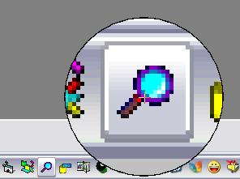



## Mouse Hotspot Magnifier

### Description

Magnifies an area at the mouse cursor hot spot; size, shape and magnification factor can easily be adjusted at compile time.

To terminate magnification move the mouse into the screen top lefthand corner. Download is 5 kB.
 
### More Info
 

             |
---                |---
**Submitted On**   |2006-03-12 00:00:00
**By**             |[ULLI](https://github.com/Planet-Source-Code/PSCIndex/blob/master/ByAuthor/ulli.md)
**Level**          |Intermediate
**User Rating**    |4.9 (44 globes from 9 users)
**Compatibility**  |VB 6\.0
**Category**       |[Graphics](https://github.com/Planet-Source-Code/PSCIndex/blob/master/ByCategory/graphics__1-46.md)
**World**          |[Visual Basic](https://github.com/Planet-Source-Code/PSCIndex/blob/master/ByWorld/visual-basic.md)
**Archive File**   |[Mouse\_Hots1979903132006\.zip](https://github.com/Planet-Source-Code/ulli-mouse-hotspot-magnifier__1-64626/archive/master.zip)

